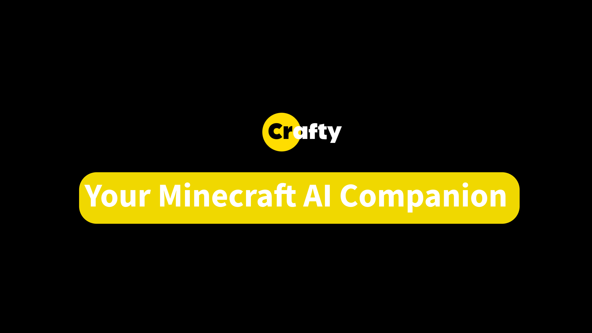

<div align="center">

# CraftyAI

### An intelligent, context-aware AI companion for your Minecraft server



**Spigot/Paper plugin · Fabric mod · Forge/NeoForge mod**

[](LICENSE)
[](https://discord.gg/zCkE44hsBR)
[](https://craftyai.pages.dev)

</div>

---

## What is CraftyAI?

CraftyAI brings a neural AI companion directly into your Minecraft server. It understands your world, remembers your conversations, and acts on your requests — chat with it, ask about the game, or let it change the time of day.

- **Context-aware chat** — the AI sees your world state, not just your messages
- **Agentic actions** — `@crafty change time to day`, `@crafty scan the area`
- **Persistent memory** — long-term memory and knowledge base per server
- **Vision support** — optional visual context on supported platforms
- **Private by design** — server owners control their connection key; AI providers are routed server-side

## Components

| Component | Platform | Minecraft versions |
|-----------|----------|--------------------|
| `craftyai-plugin` | Spigot / Paper / Purpur / Folia | 1.8+ |
| `craftyai-fabric` | Fabric (client & server) | 1.20 – 1.21.x |
| `craftyai-fabric-26` | Fabric (client & server) | 26.x (26.1 – 26.3) |
| `craftyai-forge` | Forge | 1.20.4 |
| `craftyai-forge-1206` | Forge | 1.20.6 |
| `craftyai-forge-26` | NeoForge | 26.x (26.1 – 26.3) |
| `craftyai-fabric-matrix` | Fabric Matrix Loader | 1.20.4 – 26.3 |
| `craftyai-forge-matrix` | Forge Matrix Loader | 1.20.4 – 1.21.3 |
| `craftyai-forge-modern-matrix` | Forge Modern Matrix Loader | 26.x |
| `craftyai-neoforge-legacy-matrix` | NeoForge Legacy Matrix Loader | 1.20.4 – 1.20.6 |
| `craftyai-neoforge-matrix` | NeoForge Matrix Loader | 1.21.0 – 26.3 |
| `craftyai-common` | Shared library used by all components | — |

## Installation

1. Download the jar for your platform from the [Releases](https://github.com/DemonZ-Development/craftyai-client/releases) page.
2. Drop it into `plugins/` (plugin) or `mods/` (mods).
3. Restart your server.

## Getting Started

| Platform | Steps |
|----------|-------|
| **Spigot/Paper** | As an OP, type `/crafty apikey` in-game — the plugin mints and saves your connection key. Chat with the AI by prefixing a message with `@crafty ` (or just `@`). |
| **Fabric / Forge** | Press **M** in-game or use `/crafty settings`, then click **Auto-Mint Free Key**. Chat with the AI by typing `@crafty <question>` in chat. |

### Commands

- `/crafty` — status and help
- `/crafty apikey` — view or (re)generate your connection key
- `/crafty ask <question>` — chat with the AI
- `/crafty scan` — trigger a vision scan (supported platforms)
- `/crafty settings` — open the settings screen (mods) / manage options (plugin)
- `/crafty status` — show connection status, tier, and model
- `/craftyclient cancel` — cancel an active agentic action run

## Building from Source

**Requirements:** JDK 17+ (JDK 25 for MC 26.x targets), Maven, Gradle via wrapper.

### Spigot/Paper plugin (Maven)

```bash
mvn install -f craftyai-common/pom.xml -DskipTests
mvn package -f craftyai-plugin/pom.xml -DskipTests
```

### Mods (Gradle)

The Gradle wrapper is pinned to 8.10.2 (legacy targets). CI builds MC 26.x targets with Gradle 9.6.1.

```bash
# Legacy Fabric + Forge (MC 1.20 – 1.21.x, JDK 17)
./gradlew :craftyai-fabric:build -Ptarget=legacy
./gradlew :craftyai-forge:build -Ptarget=forge-only
./gradlew :craftyai-forge-1206:build -Ptarget=forge1206

# Modern Fabric + NeoForge (MC 26.x, JDK 25, Gradle 9.x)
gradle :craftyai-fabric-26:build -Ptarget=modern
gradle :craftyai-forge-26:build -Ptarget=forge26

# Matrix builds across versions
gradle :craftyai-fabric-matrix:build -Ptarget=fabric-matrix -PminecraftVersion=1.21.1
gradle :craftyai-neoforge-matrix:build -Ptarget=neoforge-matrix -PminecraftVersion=1.21.1
```

## Documentation

- Official website and docs: https://craftyai.pages.dev
- Join the community: https://discord.gg/zCkE44hsBR

## Contributing

Contributions are welcome! Please read our [contributing guide](.github/PULL_REQUEST_TEMPLATE.md) and review the issue templates before opening an issue or pull request. Security issues should be reported privately — see [SECURITY.md](.github/SECURITY.md).

## License

This project is licensed under the [Apache License 2.0](LICENSE).

Copyright (c) 2026 DemonZ Development.
